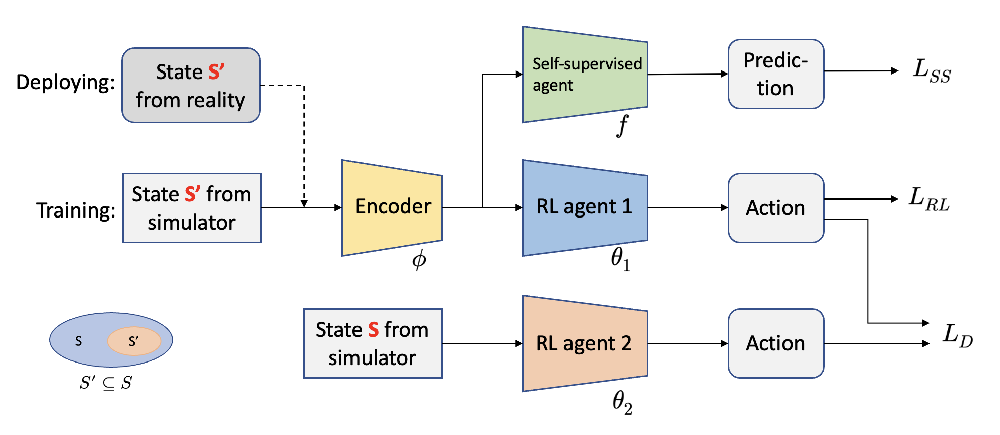
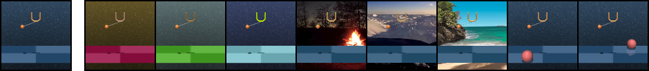

# Self-Supervised Reinforcement Learning

_Wenyuan Zhao_

## Introduction

This repository provides a PyTorch implementation of Reinforcement Learning (RL) agent with auxiliary self-supervision and knowledge distillation to mitigate domain gap and parameter gap during test time.

**Reinforcement Learning**

* Proximal Policy Optimization (PPO) with Generalized Advantage Estimation (GAE)

* Soft Actor-Critic (SAC) with Auto-Encoder (AE) 

**Self-Supervised Learning & Knowledge Distillation**




## Citation

If you find our work useful in your research, please consider citing this repository as follows:

```
@misc{pytorch_ssrl_kd,
    author = {Zhao, Wenyuan},
    title = {PyTorch Implementation of Self-supervised Reinforcement Learning with Knowledge Distillation},
    year = {2022},
    publisher = {GitHub},
    journal = {GitHub repository},
    howpublished = {\url{https://github.com/wyzhao030/SSRL-KD-pytorch}},
}
```

## Setup

We assume that you have access to a GPU with CUDA >=9.2 support. All dependencies can then be installed with the following commands:

```
conda env create -f setup/conda.yml
conda activate pad
sh setup/install_envs.sh
```

## Training & Evaluation

**PPO+GAE for discrete environments**

We provide python scripts to train PPO agent for OpenAI gym environments with discrete action space. 

To train an PPO+GAE agent on the `cartpole balance` task run: 

```
python3 src/train.py \
    --env-name cartpole \
    --seed 0 \
    --pretrained 0
```

which should give you an output of the form

```
Episode : 1 | Timestep : 1600 | Average Reward : 0.00
```

To evaluate your pre-trained PPO model run: 

```
python3 src/eval_ppo.py \
    --env-name cartpole \
    --seed 0 \
    --pretrained 0
```

which should give you an output of the form

```
average test reward : 400.0
```

**Self-supervised Learning**

We have prepared training and evaluation scripts that can be run by ```sh scripts/train.sh``` and ```sh scripts/eval.sh```. Alternatively, you can call the python scripts directly, e.g. for training call 

```
CUDA_VISIBLE_DEVICES=0 python3 src/train_pad.py \
    --domain_name cartpole \
    --task_name swingup \
    --action_repeat 8 \
    --mode train \
    --use_inv \
    --num_shared_layers 8 \
    --seed 0 \
    --work_dir logs/cartpole_swingup/inv/0 \
    --save_model
```

which should give you an output of the form 

```
| train | E: 1 | S: 1000 | D: 0.8 s | R: 0.0000 | BR: 0.0000 | 
  ALOSS: 0.0000 | CLOSS: 0.0000 | RLOSS: 0.0000
```

We provide a pre-trained model that can be used for evaluation. To run Policy Adaptation during Deployment, call 

```
CUDA_VISIBLE_DEVICES=0 python3 src/eval_kd.py \
    --domain_name cartpole \
    --task_name swingup \
    --action_repeat 8 \
    --mode color_hard \
    --use_inv \
    --num_shared_layers 8 \
    --seed 0 \
    --work_dir logs/cartpole_swingup/inv/0 \
    --pad_checkpoint 500k
```

which should give you an output of the form 

```
Evaluating logs/cartpole_swingup/inv/0 for 100 episodes (mode: color_hard)
eval reward: 666

Policy Adaptation during Deployment of logs/cartpole_swingup/inv/0 for 100 episodes (mode: color_hard)
pad reward: 722
```

Here's a few samples from the training and test environments of our benchmark:



**Knowledge Distillation**

To train a SAC+AE agent with knowledge distillation on the `cartpole swingup` task run: 

```
CUDA_VISIBLE_DEVICES=0 python3 src/train_kd.py \
    --domain_name cartpole \
    --task_name swingup \
    --action_repeat 8 \
    --mode train \
    --use_inv \
    --use_kd \
    --num_shared_layers 8 \
    --seed 1 \
    --work_dir logs/cartpole_swingup/inv/1 \
    --save_model \
    --train_steps 300000 \
    --save_freq 100000 \
    --pad_checkpoint 500k \
```

To evaluate your pre-trained model run: 

```
CUDA_VISIBLE_DEVICES=0 src/eval_kd.py \
    --domain_name cartpole \
    --task_name swingup \
    --action_repeat 8 \
    --mode color_hard \
    --use_inv \
    --num_shared_layers 8 \
    --seed 1 \
    --work_dir logs/cartpole_swingup/inv/1 \
    --pad_checkpoint 100k
```

The output is similar with what you get from self-supervised learning.
